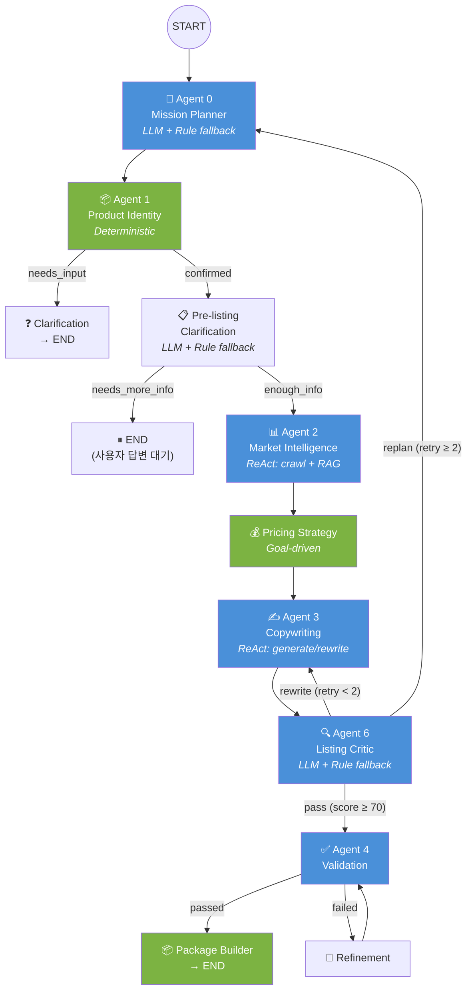

# 아키텍처 문서

## 1. 시스템 개요

중고거래(번개장터·중고나라) 자동 게시 플랫폼.
**이미지 → AI 분석 → 가격 산정 → 카피라이팅 → 게시 → 복구**의 파이프라인을
LangGraph Agentic Workflow로 구현한다.

- **7 에이전트** / **10 툴** / **3 Agentic Loop**
- Deterministic Shell + Agentic Core 하이브리드 아키텍처
- Goal-driven 행동 변화 (fast_sell / balanced / profit_max)

### Production Path

현재 production path는 **SessionService/SellerCopilotService 하이브리드 오케스트레이션**이다.
상품 식별·시세 분석은 서비스 레이어(SellerCopilotService)에서 선처리하고,
LangGraph는 `confirmed_product`와 `market_context`가 준비된 이후
**가격 전략 → 카피라이팅 → 비평 → 검증 → 패키징** 구간을 담당한다.
게시(publish)·복구(recovery)·판매 후 최적화(post_sale)는 SessionService가 노드 함수를 직접 호출하며 graph.invoke를 경유하지 않는다.

---

## 2. 그래프 플로우



---

## 3. Deterministic vs Agentic 구분

| 노드 | 유형 | LLM 역할 | 자율성 |
|---|---|---|---|
| **Agent 0: Mission Planner** | Agentic (LLM + fallback) | 목표 해석, 전략 결정 | goal 자율 선택 |
| **Agent 1: Product Identity** | Deterministic | 없음 (Vision AI 결과 소비) | 룰 기반 분기 |
| **Pre-listing Clarification** | Agentic (LLM + fallback) | 정보 부족 감지, 질문 생성 | 질문 내용 자율 결정 |
| **Agent 2: Market Intelligence** | **ReAct Agentic** | crawl/RAG 툴 자율 선택 | 데이터 부족 시 추가 검색 |
| **Pricing Strategy** | Deterministic (Goal-driven) | 없음 | goal별 배수 적용 |
| **Agent 3: Copywriting** | **ReAct Agentic** | generate/rewrite 자율 선택 | 상황 판단 후 툴 결정 |
| **Agent 6: Listing Critic** | Agentic (LLM + fallback) | 구매자 관점 품질 비평 | 점수/이슈/지시 자율 생성 |
| **Agent 4: Validation/Recovery** | **ReAct Agentic** | diagnose/patch/alert 자율 결정 | 복구 전략 자율 선택 |
| **Agent 5: Post-sale Optimization** | Deterministic | 없음 | 규칙 기반 가격 인하 |

> **파란색** = Agentic (LLM이 의사결정), **초록색** = Deterministic (룰 기반)

---

## 4. 왜 이 구조가 에이전틱인가

### 4.1 자율적 툴 선택 (Autonomous Tool Selection)

Agent 2, 3, 4는 `create_agent(llm, tools, system_prompt)`로 구성된 ReAct 에이전트다.
LLM이 **어떤 툴을 호출할지 스스로 결정**한다.

```
Agent 2 예시:
  → 시세 데이터 충분? → lc_market_crawl_tool만 호출
  → sample_count < 3? → LLM이 lc_rag_price_tool 추가 호출 결정
```

### 4.2 자기 비평 루프 (Self-Critique Loop)

Critic(Agent 6)이 Copywriting(Agent 3) 결과를 **구매자 관점에서 평가**하고,
점수가 70점 미만이면 구체적 수정 지시와 함께 재생성을 요청한다.

```
copywriting → critic → score < 70 → rewrite_instruction → copywriting → critic
                                                          (최대 2회)
```

### 4.3 적응적 재계획 (Adaptive Replanning)

Rewrite가 한도를 초과하면 단순 재작성이 아니라 **Planner로 되돌아가 전략 자체를 수정**한다.
Critic의 피드백이 Planner에 전달되어 goal이나 focus가 변경될 수 있다.

```
critic → rewrite 한도 초과 → mission_planner → product → ... → copywriting → critic
```

### 4.4 Goal-driven 행동 변화

같은 상품이라도 `mission_goal`에 따라 **전혀 다른 결과**가 나온다:

| 영역 | fast_sell | balanced | profit_max |
|---|---|---|---|
| 가격 배수 | ×0.90 (10% 할인) | ×0.97 (3% 할인) | ×1.05 (5% 프리미엄) |
| 카피 톤 | 간결·긴급감 | 실용·신뢰감 | 프리미엄·가치 강조 |
| 네고 정책 | 네고 환영 | 소폭 네고 허용 | 고정가, 가치 정당화 |
| 비평 기준 | 관용적 (설명 30자↑) | 표준 (설명 50자↑) | 엄격 (설명 80자↑) |

### 4.5 정보 부족 감지 (Pre-listing Clarification)

Agent가 판매글 작성에 필요한 정보(상태, 사용기간, 구성품, 거래방법)가 부족한지 **스스로 판단**하고,
사용자에게 질문을 생성하여 답변을 기다린다.

### 4.6 Graceful Degradation

모든 LLM 노드에 **룰 기반 fallback**이 있어 LLM 장애 시에도 파이프라인이 완주한다.
이는 프로덕션 안정성과 에이전틱 자율성의 균형이다.

---

## 5. 레이어 구조

```
┌─────────────────────────────────────────────────┐
│                 API Layer                        │
│  FastAPI routes → Pydantic validation            │
│  main.py, routers/session_router.py              │
├─────────────────────────────────────────────────┤
│               Service Layer                      │
│  SessionService, ListingService, PublishService   │
│  RecoveryService, OptimizationService            │
│  services/session_*.py, listing_*.py             │
├─────────────────────────────────────────────────┤
│                Graph Layer                        │
│  LangGraph StateGraph + 노드 + 라우팅            │
│  graph/seller_copilot_graph.py, nodes/*.py       │
├─────────────────────────────────────────────────┤
│               Domain Layer                        │
│  상태 머신, 스키마, 예외, Goal 전략               │
│  domain/session_status.py, schemas.py,           │
│  goal_strategy.py, node_contracts.py             │
├─────────────────────────────────────────────────┤
│                Tool Layer                         │
│  agentic_tools.py (facade)                       │
│  market/listing/recovery/optimization_tools.py   │
├─────────────────────────────────────────────────┤
│              External Layer                       │
│  LLM API (Gemini/OpenAI/Solar)                   │
│  Supabase (PostgreSQL + pgvector)                │
│  Playwright (웹 자동화)                           │
└─────────────────────────────────────────────────┘
```

---

## 6. 3가지 Agentic Loop

### Loop 1: Rewrite Loop (Critic → Copywriting)

```
copywriting_node → listing_critic_node
  ├─ score ≥ 70 → validation_node (통과)
  └─ score < 70 AND retry < 2
       → rewrite_instruction 설정
       → copywriting_node (재생성)
       → listing_critic_node (재평가)
```

- **최대 2회** 재시도 후 강제 통과
- Critic의 구체적 수정 지시가 Copywriting에 전달됨

### Loop 2: Replan Loop (Critic → Planner)

```
listing_critic_node
  └─ retry ≥ 2 (rewrite 한도 초과)
       → mission_planner_node (전략 재수립)
       → product_identity → ... → copywriting → critic
```

- **최대 1회** replan 후 강제 통과
- Critic 피드백이 Planner에 전달되어 goal/focus 변경 가능

### Loop 3: Recovery Loop (Validation → Refinement)

```
validation_node
  ├─ passed → package_builder_node (통과)
  └─ failed → refinement_node (자동 보정)
       → validation_node (재검증)
```

- 설명 길이 부족, 가격 0원 등 자동 보정 가능한 문제를 수정
- **최대 2회** 재시도

---

## 7. 툴 목록 (10개)

| # | 툴 이름 | 에이전트 | 유형 |
|---|---|---|---|
| 1 | `lc_market_crawl_tool` | Agent 2 | 크롤링 |
| 2 | `lc_rag_price_tool` | Agent 2 | pgvector RAG |
| 3 | `lc_generate_listing_tool` | Agent 3 | LLM 생성 |
| 4 | `lc_rewrite_listing_tool` | Agent 3 | LLM 재작성 |
| 5 | `lc_diagnose_publish_failure_tool` | Agent 4 | 규칙 진단 |
| 6 | `lc_auto_patch_tool` | Agent 4 | LLM 패치 |
| 7 | `lc_discord_alert_tool` | Agent 4 | 알림 |
| 8 | `rewrite_listing_tool` | Agent 3 | 내부 공유 |
| 9 | `diagnose_publish_failure_tool` | Agent 4 | fallback |
| 10 | `price_optimization_tool` | Agent 5 | 규칙 기반 |

---

## 8. 게시 인프라 확장 로드맵

### 현재 구조 (Phase 0)

Playwright 브라우저가 **FastAPI API 워커 내에서 직접 실행**된다.
Windows에서는 별도 스레드 + ProactorEventLoop으로 처리하며,
`asyncio.gather`로 플랫폼별 병렬 게시를 수행한다.

```
FastAPI 요청 → publish_orchestrator → publish_service.execute_publish()
  → asyncio.gather([bunjang, joongna])
    → 각각 Semaphore 획득 → ThreadPool + Browser Process
```

**동시성 제한**: `MAX_CONCURRENT_BROWSERS = 2` 세마포어로 브라우저 동시 실행을 제한하여
메모리 폭발(Chromium ~150-300MB/개)을 방지한다.

**적합 규모**: 동시 사용자 1-5명, 분당 게시 1-2건 이하.

### 한계

| 문제 | 영향 |
|------|------|
| API 워커 스레드 점유 | 게시 중 180초간 워커 블로킹, 동시 처리 한계 |
| 메모리 선형 증가 | 브라우저 수 = 메모리 사용량, 스케일아웃 불가 |
| 장애 전파 | 브라우저 크래시가 API 프로세스에 직접 영향 |
| 로드밸런서 타임아웃 | 180초 게시가 프록시 60초 기본 타임아웃과 충돌 |

### 서비스화 단계 (Phase 1) — 워커/큐 분리

```
[API 서버]                    [메시지 큐]              [게시 워커]
POST /publish                  Redis / SQS             Celery Worker
  → 202 Accepted              ─────────────►           (Playwright)
  → task_id 반환                                        ↓
                                                     브라우저 실행
GET /publish/{task_id}/status  ◄─────────────          결과 저장
  or SSE stream                  결과 콜백
```

**변경 사항**:
- `POST /publish` → `202 Accepted` + `task_id` 반환 (즉시 응답)
- 게시 결과는 SSE 또는 폴링으로 수신
- 게시 워커를 별도 컨테이너/프로세스로 분리
- 워커 수평 확장 가능 (게시량에 비례)
- API 서버는 브라우저 프로세스와 완전 격리
